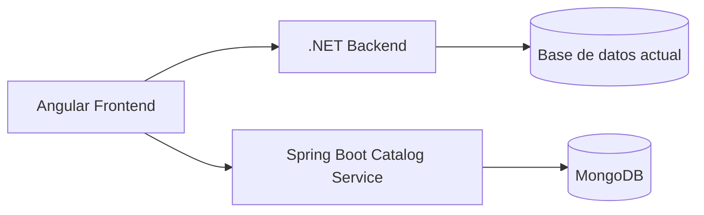

# Migración parcial a microservicios — Spring Boot + MongoDB

## Contexto

Trabaja sobre el siguiente proyecto y rama:

```text
Repositorio:
https://github.com/melgust/desaweb2026a

Branch:
cherrerap5

Proyecto:
practice3/cherrerap5
```

Actualmente el proyecto tiene aproximadamente esta estructura:

```text
practice3/cherrerap5/
├── backend/
│   └── src/
│       ├── Api/
│       ├── Application/
│       ├── Domain/
│       └── Infrastructure/
│
├── frontend/
│   └── src/app/
│       ├── core/
│       └── features/
│
└── docker-compose.yml
```

El backend actual está desarrollado en **.NET** y el frontend en **Angular**.

Estamos iniciando una migración progresiva hacia una arquitectura basada en microservicios.

En esta etapa deben migrarse únicamente los siguientes dominios:

- Categorías
- Productos
- Suppliers / Proveedores

El resto del backend debe continuar funcionando en .NET.

---

# Objetivo principal

Crear dentro de:

```text
practice3/cherrerap5
```

un nuevo microservicio basado en:

- Java
- Spring Boot
- Spring Web
- Spring Data MongoDB
- MongoDB
- Maven
- Docker
- Docker Compose

El nuevo microservicio será responsable exclusivamente de:

```text
Category
Product
Supplier
```

Posteriormente, actualizar el frontend Angular para que las operaciones relacionadas con estas entidades consuman el nuevo microservicio Spring Boot en lugar de los endpoints anteriores del backend .NET.

Finalmente, eliminar del backend .NET solamente el código que quede completamente reemplazado por el nuevo microservicio.

---

# Restricción fundamental

Esta es una **migración parcial**.

NO conviertas todo el backend .NET a Spring.

NO elimines funcionalidades relacionadas con:

- autenticación;
- invoices/facturas;
- usuarios;
- seguridad;
- cualquier otro dominio que todavía dependa del backend .NET.

Después del cambio deben coexistir:

```text
Angular Frontend
       |
       |----------------------|
       |                      |
       v                      v
.NET Backend           Spring Boot Microservice
       |                      |
       v                      v
BD actual                  MongoDB
```

El backend .NET continuará manejando las funcionalidades no migradas.

Spring Boot manejará:

```text
Categories
Products
Suppliers
```

---

# FASE 1 — Analizar antes de modificar

Antes de escribir código, inspecciona completamente las implementaciones actuales de:

```text
CategoriesController.cs
ProductsController.cs
SuppliersController.cs
```

Analiza también todas las clases relacionadas ubicadas en:

```text
backend/src/Application
backend/src/Domain
backend/src/Infrastructure
```

Debes identificar:

- entidades;
- DTOs;
- requests;
- responses;
- repositories;
- services;
- interfaces;
- validaciones;
- relaciones;
- reglas de negocio;
- endpoints;
- códigos HTTP;
- filtros;
- campos obligatorios;
- comportamiento de actualización;
- comportamiento de eliminación.

También inspecciona en Angular todo lo relacionado con:

```text
frontend/src/app/features/products
frontend/src/app/features/suppliers
```

y cualquier otro archivo que consuma:

```text
/api/categories
/api/products
/api/suppliers
```

No asumas contratos.

Obtén los contratos actuales directamente del código.

---

# FASE 2 — Definir ownership de datos

El nuevo microservicio será el propietario de los datos de:

```text
categories
products
suppliers
```

MongoDB será la fuente de verdad para estos tres dominios.

No mantengas escrituras simultáneas en:

```text
.NET database
+
MongoDB
```

para estas entidades.

Evita implementar dual-write.

Una vez migrados:

```text
Category -> MongoDB
Product -> MongoDB
Supplier -> MongoDB
```

las operaciones CRUD deberán ejecutarse exclusivamente contra MongoDB.

---

# FASE 3 — Crear microservicio Spring Boot

Crear una nueva carpeta dentro de:

```text
practice3/cherrerap5
```

preferentemente:

```text
catalog-service/
```

La estructura esperada debe ser aproximadamente:

```text
catalog-service/
├── pom.xml
├── Dockerfile
├── .dockerignore
└── src/
    ├── main/
    │   ├── java/
    │   │   └── .../
    │   │       ├── controller/
    │   │       ├── service/
    │   │       ├── repository/
    │   │       ├── model/
    │   │       ├── dto/
    │   │       ├── mapper/
    │   │       ├── exception/
    │   │       └── config/
    │   │
    │   └── resources/
    │       └── application.yml
    │
    └── test/
```

No es obligatorio crear carpetas vacías.

Utiliza una estructura limpia y coherente con Spring Boot.

---

# FASE 4 — Dependencias Spring

Configura como mínimo:

```text
spring-boot-starter-web
spring-boot-starter-data-mongodb
spring-boot-starter-validation
spring-boot-starter-test
```

Puedes utilizar Lombok únicamente si realmente simplifica el proyecto.

Evita dependencias innecesarias.

---

# FASE 5 — MongoDB

Agregar MongoDB al entorno Docker.

Configurar la conexión mediante variables de entorno.

Por ejemplo:

```yaml
SPRING_DATA_MONGODB_URI=mongodb://mongo:27017/catalog_db
```

No hardcodear:

- passwords;
- hosts;
- credenciales;
- URLs dependientes del entorno.

En desarrollo local debe poder configurarse mediante:

```text
application.yml
```

y variables de entorno de Docker Compose.

---

# FASE 6 — Modelos MongoDB

Crear documentos MongoDB equivalentes a los modelos actuales.

Como mínimo deberán existir:

```text
Category
Product
Supplier
```

No inventes campos.

Primero inspecciona los modelos actuales de .NET y conserva la información necesaria para que el frontend continúe funcionando.

Utiliza:

```java
@Document
```

y los identificadores apropiados para MongoDB.

Ejemplo conceptual:

```java
@Document(collection = "categories")
public class Category {
    @Id
    private String id;
}
```

No copies este modelo literalmente si el dominio actual contiene más propiedades.

---

# FASE 7 — Relaciones en MongoDB

Analiza las relaciones actuales de Product con:

```text
Category
Supplier
```

Adáptalas correctamente a MongoDB.

Prioriza referencias mediante identificadores simples cuando sea suficiente, por ejemplo:

```text
categoryId
supplierId
```

Evita introducir relaciones complejas tipo SQL si no son necesarias.

Antes de crear o actualizar un Product, valida que los identificadores relacionados existan cuando las reglas actuales lo requieran.

---

# FASE 8 — Repositories

Crear repositories utilizando:

```java
MongoRepository
```

Por ejemplo conceptualmente:

```java
public interface ProductRepository
    extends MongoRepository<Product, String> {
}
```

Agregar métodos adicionales solamente cuando sean necesarios para mantener las búsquedas o validaciones existentes.

---

# FASE 9 — Services

La lógica de negocio no debe quedar directamente en los controllers.

Implementar una capa:

```text
Controller
    ↓
Service
    ↓
Repository
    ↓
MongoDB
```

Crear services separados para:

```text
CategoryService
ProductService
SupplierService
```

Puedes utilizar interfaces + implementaciones si aporta claridad.

---

# FASE 10 — API REST

Implementar los endpoints necesarios para conservar las operaciones actuales.

Preferentemente mantener rutas equivalentes a las existentes para minimizar cambios en Angular.

Ejemplo:

```text
/api/categories
/api/products
/api/suppliers
```

Para cada recurso implementar las operaciones que existan actualmente.

Si actualmente existe CRUD completo, preservar:

```text
GET    /api/categories
GET    /api/categories/{id}
POST   /api/categories
PUT    /api/categories/{id}
DELETE /api/categories/{id}
```

y equivalentes para:

```text
products
suppliers
```

No agregues endpoints solamente porque sean habituales.

El contrato real debe salir del backend existente.

---

# FASE 11 — Compatibilidad con Angular

Uno de los objetivos principales es evitar cambios innecesarios en componentes y templates.

Cuando sea razonable, conserva:

- nombres de propiedades;
- estructuras de requests;
- estructuras de responses;
- rutas;
- semántica CRUD.

Si el backend .NET devuelve actualmente:

```json
{
  "id": 1,
  "name": "..."
}
```

no cambies arbitrariamente a:

```json
{
  "_id": "...",
  "categoryName": "..."
}
```

solo por utilizar MongoDB.

El detalle interno de MongoDB no debe acoplarse innecesariamente al frontend.

Usa DTOs cuando sea necesario para preservar el contrato.

---

# FASE 12 — IDs SQL vs MongoDB

Presta especial atención a este punto.

El backend actual puede utilizar IDs:

```text
int
long
Guid
```

mientras MongoDB normalmente utiliza:

```text
ObjectId/String
```

No rompas Angular por este cambio.

Analiza cómo usa actualmente el frontend los identificadores.

Si migras a String:

```typescript
id: string;
```

actualiza solamente las interfaces, servicios y lugares necesarios.

No permitas errores del tipo:

```text
number vs string
```

durante compilación de Angular.

---

# FASE 13 — Validaciones

Preserva las validaciones actuales.

Implementa validación utilizando:

```java
@Valid
@NotNull
@NotBlank
@Size
@Positive
@PositiveOrZero
```

según corresponda al modelo real.

No inventes restricciones nuevas que puedan alterar comportamiento existente.

---

# FASE 14 — Manejo global de errores

Crear manejo consistente de errores mediante:

```java
@RestControllerAdvice
```

Manejar al menos cuando corresponda:

```text
400 Bad Request
404 Not Found
409 Conflict
500 Internal Server Error
```

No retornar stack traces al frontend.

Mantener respuestas de error claras y consistentes.

---

# FASE 15 — CORS

Configurar Spring Boot para aceptar peticiones provenientes del frontend Angular.

No utilizar una política excesivamente permisiva si existe una URL conocida en configuración.

Permitir configurar los origins mediante variables de entorno cuando sea razonable.

---

# FASE 16 — Migrar los servicios Angular

Localiza todos los servicios Angular que actualmente consumen Category, Product y Supplier.

Reemplaza únicamente esas llamadas.

Por ejemplo, si actualmente existe:

```typescript
private apiUrl = `${environment.apiUrl}/api/products`;
```

y el nuevo microservicio usa una URL independiente, crear una configuración específica, por ejemplo:

```typescript
environment.catalogApiUrl
```

Entonces:

```typescript
private apiUrl = `${environment.catalogApiUrl}/api/products`;
```

Haz lo mismo para:

```text
categories
products
suppliers
```

No migres:

```text
auth
invoices
otros recursos
```

Estos deben continuar utilizando el backend .NET.

---

# FASE 17 — Separación de URLs del frontend

El frontend debe poder trabajar simultáneamente con ambos backends.

Conceptualmente:

```typescript
environment = {
    apiUrl: '...',
    catalogApiUrl: '...'
};
```

Donde:

```text
apiUrl
```

continúa apuntando al backend .NET.

Y:

```text
catalogApiUrl
```

apunta al nuevo microservicio Spring Boot.

Evita URLs hardcodeadas directamente dentro de componentes.

---

# FASE 18 — Eliminar implementación antigua del backend .NET

ÚNICAMENTE después de comprobar que el nuevo microservicio funciona:

Eliminar del backend .NET las implementaciones correspondientes a:

```text
Categories
Products
Suppliers
```

Esto incluye, cuando corresponda:

- controllers;
- services;
- interfaces;
- repositories;
- handlers;
- DTOs exclusivamente utilizados por estos dominios;
- código de persistencia exclusivamente utilizado por estos dominios.

Actualmente existen al menos los siguientes controllers que deberán desaparecer una vez completada la migración:

```text
CategoriesController.cs
ProductsController.cs
SuppliersController.cs
```

Antes de eliminar cualquier otra clase, revisar sus referencias.

NO borrar una clase si sigue siendo utilizada por:

```text
Invoices
Auth
otros módulos
```

---

# MUY IMPORTANTE — Dependencias cruzadas

Antes de eliminar Product del backend .NET, revisa si:

```text
Invoices
```

u otros módulos utilizan directamente entidades Product de la base de datos existente.

Si Invoice depende de Product, NO rompas facturación.

En ese caso:

1. identifica exactamente la dependencia;
2. desacóplala de manera mínima;
3. conserva los datos necesarios para las facturas existentes;
4. evita introducir una reescritura completa del módulo Invoice.

Si una factura necesita conservar información histórica del producto, prioriza datos propios de la factura como:

```text
productId
productName
unitPrice
quantity
```

en lugar de depender de una entidad Product mutable.

No hagas esta modificación si el modelo actual ya resuelve correctamente este problema.

---

# FASE 19 — Dockerfile del microservicio

Crear un Dockerfile multi-stage.

Ejemplo conceptual:

```dockerfile
FROM maven:3.9-eclipse-temurin-21 AS build

WORKDIR /app

COPY pom.xml .
RUN mvn dependency:go-offline

COPY src ./src
RUN mvn clean package -DskipTests

FROM eclipse-temurin:21-jre

WORKDIR /app

COPY --from=build /app/target/*.jar app.jar

EXPOSE 8080

ENTRYPOINT ["java", "-jar", "app.jar"]
```

Puedes adaptar versiones según la versión estable elegida para el proyecto.

---

# FASE 20 — Docker Compose

Actualizar:

```text
practice3/cherrerap5/docker-compose.yml
```

para ejecutar como mínimo:

```text
frontend
backend .NET
catalog-service
mongodb
```

Conceptualmente:

```text
frontend
   |
   +----> backend
   |
   +----> catalog-service
               |
               v
             mongodb
```

Configurar:

- red Docker compartida;
- puertos;
- variables de entorno;
- dependencias;
- volúmenes.

MongoDB debe utilizar un volumen persistente.

Ejemplo:

```yaml
volumes:
  mongo_data:
```

---

# FASE 21 — Networking Docker

Dentro de Docker Compose NO utilizar:

```text
localhost
```

para comunicar contenedores.

Utilizar los nombres de servicio.

Por ejemplo:

```text
mongodb://mongo:27017/catalog_db
```

El acceso desde el navegador al microservicio sí deberá utilizar una URL accesible desde el host o configurarse mediante el reverse proxy/frontend según la arquitectura actual.

---

# FASE 22 — Healthcheck

Agregar healthcheck a MongoDB.

Si es viable, agregar también healthcheck al microservicio.

No hacer que el contenedor Spring dependa solamente de:

```yaml
depends_on:
  - mongo
```

si puede iniciarse antes de que Mongo esté listo.

---

# FASE 23 — Datos existentes

Analiza si el proyecto actual contiene seed data o datos iniciales para:

```text
Categories
Products
Suppliers
```

Si existe información necesaria para que la aplicación funcione al iniciar, implementar un mecanismo simple de inicialización de MongoDB.

Debe ser idempotente.

Ejemplo conceptual:

```text
si colección vacía:
    insertar datos iniciales
```

No insertar duplicados en cada inicio.

---

# FASE 24 — No crear migración compleja innecesaria

Este es un proyecto académico y una migración progresiva.

No implementar innecesariamente:

- Kafka;
- RabbitMQ;
- Kubernetes;
- service discovery;
- Eureka;
- Config Server;
- API Gateway empresarial;
- CQRS;
- Event Sourcing;
- Saga;
- Redis;

salvo que ya existan o sean estrictamente necesarios.

Mantener la solución sencilla, funcional y defendible académicamente.

---

# FASE 25 — Tests

Crear pruebas relevantes para el nuevo microservicio.

Como mínimo probar:

- creación;
- consulta;
- actualización;
- eliminación;
- validaciones;
- recurso no encontrado.

Prioriza service tests y controller tests útiles.

No crear tests triviales únicamente para aumentar cantidad.

---

# FASE 26 — Compilación

Después de implementar:

Ejecutar y corregir todos los problemas detectados en:

```bash
mvn test
```

```bash
mvn clean package
```

Después validar Angular:

```bash
npm install
npm run build
```

Después validar el entorno:

```bash
docker compose config
```

y, si el entorno lo permite:

```bash
docker compose up --build
```

No considerar completada la tarea si existen errores de compilación.

---

# FASE 27 — Prueba funcional mínima

Verificar que desde Angular continúen funcionando:

### Categorías

```text
listar
crear
editar
eliminar
```

según las operaciones que ya soporta el proyecto.

### Productos

```text
listar
crear
editar
eliminar
```

según corresponda.

### Suppliers

```text
listar
crear
editar
eliminar
```

según corresponda.

También comprobar que sigan funcionando contra .NET:

```text
Login/Auth
Invoices
```

No aceptar una migración que haga funcionar Spring pero rompa los módulos que permanecen en .NET.

---

# FASE 28 — Limpieza

Eliminar:

- imports muertos;
- código comentado antiguo;
- services Angular que ya no se utilizan;
- referencias a endpoints .NET eliminados;
- configuraciones obsoletas;
- archivos generados innecesarios.

No eliminar:

```text
node_modules
dist
bin
obj
```

mediante cambios destructivos si simplemente deben estar ignorados por Git.

Actualizar `.gitignore` cuando corresponda.

---

# FASE 29 — README

Actualizar:

```text
practice3/cherrerap5/README.md
```

Explicar la nueva arquitectura.

Agregar una sección:

```markdown
## Arquitectura de microservicios
```

Documentar:

```text
Angular
.NET Backend
Spring Boot Catalog Service
MongoDB
Docker Compose
```

Agregar un diagrama Mermaid similar a:



Adaptarlo a la arquitectura real encontrada.

---

# FASE 30 — Documentar responsabilidades

En README indicar claramente:

| Dominio | Responsable |
|---|---|
| Authentication | .NET |
| Invoices | .NET |
| Categories | Spring Boot |
| Products | Spring Boot |
| Suppliers | Spring Boot |

Actualizar esta tabla si del análisis surge alguna diferencia necesaria.

---

# Criterios de aceptación

La tarea se considera terminada solamente si se cumplen TODOS los siguientes puntos:

- Existe un nuevo microservicio Spring Boot funcional.
- Spring Boot utiliza MongoDB.
- Category fue migrado.
- Product fue migrado.
- Supplier fue migrado.
- Angular consume Spring para esos tres dominios.
- Angular continúa consumiendo .NET para los dominios no migrados.
- El código antiguo de Category/Product/Supplier fue eliminado de .NET cuando ya no tiene referencias.
- No se rompió Auth.
- No se rompió Invoices.
- MongoDB corre mediante Docker.
- Spring Boot corre mediante Docker.
- El frontend continúa dockerizado.
- El backend .NET continúa dockerizado.
- `docker-compose.yml` levanta la arquitectura completa.
- No existen endpoints duplicados activos para los dominios migrados.
- No existe dual-write.
- `mvn test` pasa.
- `mvn clean package` pasa.
- Angular compila.
- Docker Compose es válido.
- README refleja la arquitectura nueva.

---

# Reglas de implementación

1. Analiza antes de modificar.
2. No inventes contratos si puedes obtenerlos del código actual.
3. Haz cambios mínimos fuera de los dominios migrados.
4. Preserva funcionalidad existente.
5. No reescribas componentes Angular si basta con modificar services.
6. No conviertas todo el backend a Spring.
7. No elimines código .NET que todavía tenga dependencias.
8. No dupliques ownership de datos.
9. MongoDB debe ser la fuente de verdad para los dominios migrados.
10. Mantén el proyecto fácil de ejecutar con Docker Compose.
11. Utiliza configuración por variables de entorno.
12. No introduzcas infraestructura empresarial innecesaria.
13. Corrige errores de compilación encontrados como consecuencia directa de la migración.
14. No dejes TODOs correspondientes al alcance solicitado.
15. No dejes código ficticio o placeholders.

---

# Resultado esperado

Al terminar, la estructura debería aproximarse a:

```text
practice3/cherrerap5/
├── backend/
│   └── ...
│
├── catalog-service/
│   ├── Dockerfile
│   ├── pom.xml
│   └── src/
│
├── frontend/
│   └── ...
│
├── docker-compose.yml
└── README.md
```

Con esta distribución:

```text
                    ┌───────────────────┐
                    │      Angular      │
                    └─────────┬─────────┘
                              │
                 ┌────────────┴────────────┐
                 │                         │
                 ▼                         ▼
       ┌──────────────────┐      ┌──────────────────────┐
       │   .NET Backend   │      │ Spring Boot Catalog  │
       │                  │      │       Service        │
       │ Auth             │      │ Categories           │
       │ Invoices         │      │ Products             │
       │ Otros            │      │ Suppliers            │
       └────────┬─────────┘      └──────────┬───────────┘
                │                           │
                ▼                           ▼
       ┌──────────────────┐        ┌─────────────────┐
       │ BD actual        │        │    MongoDB      │
       └──────────────────┘        └─────────────────┘
```

---

# Entrega final de Codex

Al terminar los cambios, entrega un resumen con este formato:

```markdown
## Resumen de implementación

### Microservicio creado
- ...

### Entidades migradas
- Category
- Product
- Supplier

### Endpoints Spring Boot
- ...

### Cambios realizados en Angular
- ...

### Código eliminado del backend .NET
- ...

### Docker
- ...

### MongoDB
- ...

### Archivos principales modificados
- ...

### Validaciones ejecutadas
- mvn test:
- mvn clean package:
- npm run build:
- docker compose config:
- docker compose up --build:

### Decisiones técnicas importantes
- ...

### Dependencias o riesgos encontrados
- ...
```

Si durante el análisis encuentras una dependencia entre `Invoices` y `Products`, resuélvela de la manera menos invasiva posible y explica claramente qué hiciste.

Ejecuta la migración completa dentro del alcance indicado. No te limites a describir los pasos: modifica efectivamente el proyecto.