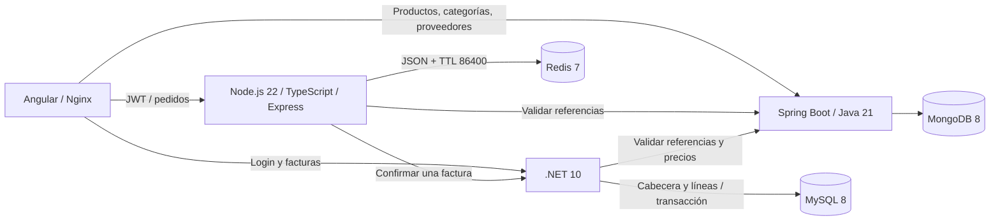

# Enterprise Management — pedidos temporales y facturas con varios productos

Implementación de las fases 1–35. Angular consume tres servicios: autenticación y
facturas en .NET/MySQL, catálogo en Spring Boot/MongoDB, y pedidos temporales en
Node.js/Redis. **Confirmar un carrito crea una sola factura con todas sus líneas.**

## Arquitectura implementada



| Componente | Responsabilidad | Puerto local |
| --- | --- | --- |
| Angular 18 / Nginx | Productos, proveedores, pedidos y facturas | 81; desarrollo 4200 |
| .NET 10 | JWT y facturas definitivas con varias líneas | 5000 |
| Spring Boot 4 / Java 21 | Productos, categorías y proveedores | 8080 |
| Node.js 22 / TypeScript | Pedidos temporales y confirmación | 3000 |
| Redis 7 | Fuente de verdad de los pedidos, TTL nativo y AOF | 6379, solo loopback |
| MySQL 8 | Usuarios, roles, cabeceras y líneas de facturas | 3307 |
| MongoDB 8 | Catálogo | 27017 |

Redis no almacena facturas y MySQL/MongoDB no almacenan borradores. Cada línea de
factura conserva nombres históricos, por lo que su consulta no depende del catálogo.

## Cómo ejecutar

Desde `practice3/cherrerap5`:

1. Copiar `.env.example` a `.env`.
2. Configurar `JWT_SECRET` con una clave privada de al menos 32 caracteres.
3. Iniciar Docker Desktop y ejecutar:

```sh
docker compose config --quiet
docker compose up -d --build
docker compose ps
```

Abrir **http://localhost:81**. Compose comparte la clave JWT con .NET y Node.
Si cambia la clave, iniciar sesión otra vez. `.env` y respaldos locales están
excluidos de Git. En esta entrega ya se generó un `.env` local.

Los usuarios iniciales de desarrollo se mantienen:

| Usuario | Contraseña de desarrollo | Rol |
| --- | --- | --- |
| admin@enterprise.com | Admin123! | Admin |
| user@enterprise.com | User123! | User |

Admin y Manager crean/editan facturas y confirman pedidos. User puede preparar su
carrito y consultar facturas, respetando los permisos existentes. Solo Admin elimina.

El catálogo inicial crea productos y categorías. Si no existe ningún proveedor
activo, crearlo desde **Suppliers** antes de agregar productos al pedido.

### Flujo de usuario

1. Iniciar sesión y abrir Products.
2. Elegir «Agregar al pedido», proveedor y cantidad; repetir para otro producto.
3. Abrir **Pedidos (cantidad)**; revisar subtotales y modificar o eliminar líneas.
4. Confirmar. Solo al recibir éxito se vacía el carrito y se abre el detalle de la
   factura generada, con todos los productos.
5. Si falla, conservar el pedido y reintentar. Si expiró, la consulta devuelve 404
   y Angular retira los datos antiguos. También se puede vaciar voluntariamente.

El catálogo no relaciona directamente productos y proveedores: el proveedor se
selecciona por línea. Un mismo producto tiene una sola línea en el carrito.

## Facturas con varios productos y migración

`Invoice` es la cabecera (número, fechas, estado, notas, total). `InvoiceItems`
contiene producto/proveedor, sus nombres históricos, cantidad, precio y subtotal.
Crear y editar guardan cabecera y todas las líneas en una transacción EF Core.

La migración `20260915040641_InvoiceLineItems`:

1. Crea `InvoiceItems` y los campos de idempotencia de la cabecera.
2. Copia cada factura histórica a una línea, conservando nombres, cantidades,
   precios, importes, ID de factura, fecha y número.
3. Retira las columnas de producto/proveedor de la cabecera.

Se aplica automáticamente al iniciar .NET. Antes de aplicarla en esta entrega se
guardó `.local/backups/before-invoice-lines.sql`. El descenso automático a una
factura de un solo producto está bloqueado para impedir pérdida de líneas; un
rollback exige restaurar un respaldo anterior. No se debe ejecutar `down -v`
si se quieren conservar las bases de datos.

Los contratos de creación/edición ahora reciben `items[]`; Angular se actualizó
junto con .NET. Los clientes externos del contrato antiguo también deben adaptarse.

```json
{
  "number": "INV-2026-001",
  "invoiceDate": "2026-09-15T00:00:00Z",
  "dueDate": null,
  "status": "Pending",
  "notes": "Compra de varios productos",
  "items": [
    { "productId": "id-del-catalogo", "supplierId": "id-del-proveedor", "quantity": 2, "unitPrice": 125.50 }
  ]
}
```

Los IDs válidos son UUID o Mongo ObjectId de 24 caracteres. Los precios manuales
de facturas son editables por Admin/Manager; la confirmación de pedidos obtiene
los precios definitivos directamente del catálogo en .NET y recalcula los totales.

## API Order Service

Enviar `Authorization: Bearer <JWT de .NET>` en `/api/orders`.

| Método | Ruta | Cuerpo / respuesta |
| --- | --- | --- |
| GET | `/api/orders/current` | Pedido actual; 404 si no existe |
| POST | `/api/orders/items` | `{productId,supplierId,quantity}`; incrementa duplicados |
| PUT | `/api/orders/items/:productId` | `{quantity}`; entero positivo |
| DELETE | `/api/orders/items/:productId` | Pedido recalculado |
| DELETE | `/api/orders/current` | 204; elimina inmediatamente |
| POST | `/api/orders/confirm` | `{orderId,invoice}`; una factura con `items[]` |
| GET | `/health` | Redis PING: 200 UP o 503 DOWN |

Validaciones: cantidad entera 1–100000, máximo 100 productos, producto/proveedor
activo, JWT válido. Se rechazan `userId`, `role`, `unitPrice`, `subtotal` y `total`
en el cuerpo del carrito. El usuario proviene exclusivamente del JWT.

Errores: 400 datos inválidos; 401 JWT; 403 permisos; 404 pedido/línea ausente;
409 operación concurrente o confirmación pendiente; 422 referencia inexistente;
503 dependencia no disponible. Los mensajes identifican el producto que impide
confirmar. Cantidad cero se rechaza; eliminar requiere DELETE.

## Redis, TTL y reintentos

- Un JSON por usuario: `order:draft:user:{userId}`; cada pedido tiene UUID propio.
- `SET ... EX 86400` en Lua al agregar, cambiar cantidad o eliminar una línea.
- GET no renueva el TTL; no hay cron. `expiresAt` proviene del servidor y el TTL
  nativo de Redis determina la expiración. AOF persiste datos y vencimientos.
- Un bloqueo por usuario serializa escrituras; los scripts verifican su propietario
  para que una operación con bloqueo vencido no sobrescriba otra.
- La confirmación pasa a `CONFIRMING` usando KEEPTTL. Un timeout/5xx conserva el
  contenido y permite reintentar confirmar; edición/cancelación quedan bloqueadas
  para evitar cambiar una operación cuyo resultado podría haberse guardado.
- Un rechazo definitivo 400/401/403/404/422 restaura DRAFT sin renovar el TTL.
- Solo una respuesta definitiva válida permite `DEL`. Si falla Redis después del
  commit, el reintento recupera la misma factura.
- .NET guarda una clave única derivada de usuario+orderId y una huella del contenido.
  Los reintentos no crean duplicados, aunque cambie el número de la factura. Las
  facturas provenientes de pedidos se eliminan lógicamente para conservar esa clave.
- Si el carrito vence durante una respuesta incierta, las facturas ya creadas se
  pueden consultar en Facturas. No se revierte una factura confirmada por un timeout.

## Angular y configuración HTTP

`core/services/order.service.ts` centraliza GET/POST/PUT/DELETE y el estado del
carrito; los componentes no hacen HTTP directamente. El estado se reinicia al
cambiar de usuario y descarta respuestas pertenecientes a una sesión anterior.
El menú muestra la cantidad de unidades. La vista consulta al servidor al enfocarse
y cada 30 segundos, sin implementar expiración local de los datos.

En desarrollo se usan las URLs de `environment.ts`. En Docker Nginx publica
`/api` (.NET), `/catalog-api` (Spring) y `/order-api` (Node) bajo el mismo origen.
El interceptor adjunta JWT solo a estos destinos y cierra la sesión ante 401.
CORS y las URLs internas se configuran por entorno.

## Desarrollo local

Requisitos: Node.js 22+, .NET SDK 10, Java 21/Maven 3.9; Redis, MySQL y MongoDB.

```sh
docker compose up -d db mongo redis catalog-service
```

Para .NET configurar `Jwt__Key` igual a `JWT_SECRET`,
`ConnectionStrings__DefaultConnection` con MySQL local en puerto 3307 y
`ASPNETCORE_URLS=http://localhost:5000`; luego:

```sh
cd backend
dotnet run --project src/Api/Api.csproj
```

Para Node, copiar `order-service/.env.example` a `.env`, usar la misma clave JWT y:

```sh
cd order-service
npm ci
npm run dev
```

Para Angular: `cd frontend`, `npm ci`, `npm start` (http://localhost:4200).
Para catálogo sin contenedor: `cd catalog-service`, `mvn spring-boot:run`.

## Pruebas y validación

```sh
# Node: unitarias, HTTP y contratos
cd order-service
npm run build
npm run lint
npm test

# Escenario completo con login, catálogo, Redis y .NET activos
npm run test:e2e

# Facturas y persistencia relacional en memoria
cd ../backend
dotnet test tests/InvoiceService.Tests/InvoiceService.Tests.csproj

# Angular y navegador contra los contenedores activos
cd ../frontend
npm run build
npx playwright install chromium
npm test
```

Definir `REDIS_TEST_URL=redis://localhost:6379` para activar las pruebas de Redis
real en `npm test`. Verifican TTL de 86400, renovación, KEEPTTL, contención, bloqueo
vencido, DEL y expiración nativa con un TTL de prueba de 1 segundo.
`ORDER_TTL_SECONDS` acepta un valor corto únicamente con `NODE_ENV=test`.

La prueba de migración real se activa con `TEST_MYSQL_ADMIN_CONNECTION`; crea y
elimina **solo una base temporal `invtest_<UUID>`**, nunca la base de la aplicación.
Ejemplo de cadena: `Server=localhost;Port=3307;User Id=root;Password=<clave>;`.

Los E2E usan por defecto el administrador de desarrollo. Se pueden configurar
`E2E_EMAIL`, `E2E_PASSWORD` y las URLs `E2E_FRONTEND_URL`, `E2E_BACKEND_URL`,
`E2E_ORDER_URL`, `E2E_CATALOG_URL`. Requieren una cuenta sin carrito previo; no
sobrescriben un pedido existente. Retiran sus carritos y facturas al terminar;
se conserva la marca de idempotencia de las facturas eliminadas.

El Dockerfile del catálogo ejecuta sus siete pruebas durante la construcción.
Resultados de esta entrega: [informe de validación](docs/order-implementation.md).

## Redes con certificados locales

Los Dockerfiles aceptan certificados de confianza opcionales mediante secretos de
BuildKit, sin incorporarlos a las imágenes ni desactivar TLS. En esta máquina se
generaron `.local/trusted-ca.pem`, `.local/java-cacerts` y un
`docker-compose.override.yml` local a partir de `docker-compose.ca.yml`.
Por eso el comando normal `docker compose up -d --build` también funciona aquí.

Para reproducir esa configuración en Windows ejecutar
`powershell -File scripts/configure-build-trust.ps1` con `keytool` en PATH.
En una red que no lo necesita, basta `docker-compose.yml` sin el override.

## Archivos y decisiones

- `order-service/`: API, JWT, validadores, Redis, clientes HTTP y pruebas.
- `backend/src/Domain/Entities/Invoice.cs`: cabecera y líneas; migración y pruebas
  en sus carpetas correspondientes.
- `frontend/src/app/features/orders/`: carrito; `features/invoices/`: listado,
  formulario con varias líneas y detalle; productos conserva su CRUD administrativo.
- [Contrato y decisiones de pedidos](order-service/README.md).
- [Propiedad del catálogo](docs/catalog-data-ownership.md) y
  [relaciones del catálogo](docs/catalog-relationships.md).
