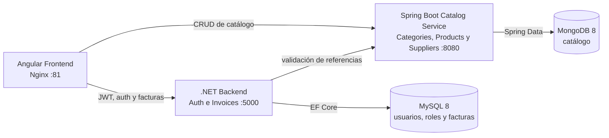

# Enterprise Management Solution

Aplicación académica de gestión empresarial con frontend Angular y dos backends especializados. Autenticación y facturas permanecen en .NET/MySQL; el catálogo de categorías, productos y proveedores pertenece a Spring Boot/MongoDB.

## Arquitectura de microservicios



Docker Compose conecta los contenedores mediante `enterprise_network`. Entre contenedores se usan los nombres `db`, `mongo` y `catalog-service`; las URLs con `localhost` corresponden únicamente al acceso desde el navegador o desde el host.

### Responsabilidades

| Componente | Responsabilidad | Persistencia |
|---|---|---|
| Angular 18 | Interfaz, rutas, formularios y envío del JWT | Navegador |
| Backend .NET 10 | Login, roles, usuarios y facturas | MySQL 8 |
| Spring Boot 4 / Java 21 | Categorías, productos y proveedores | MongoDB 8 |
| Docker Compose | Red, variables, dependencias, healthchecks y volúmenes | `db_data`, `mongo_data` |

### Responsabilidad por dominio

| Dominio | Responsable | Fuente de verdad |
|---|---|---|
| Authentication | Backend .NET | MySQL |
| Invoices | Backend .NET | MySQL |
| Categories | Spring Boot Catalog Service | MongoDB |
| Products | Spring Boot Catalog Service | MongoDB |
| Suppliers | Spring Boot Catalog Service | MongoDB |

No existe escritura duplicada entre MySQL y MongoDB. Angular consume cada dominio desde su servicio propietario.

Las facturas guardan `productId`, `productName`, `supplierId` y `supplierName` como datos históricos. Al crear o editar una factura, .NET valida las referencias contra Catalog Service; consultar una factura existente no depende de que el producto o proveedor continúe en MongoDB.

## Puertos

| Servicio | URL desde el host | Puerto interno |
|---|---|---|
| Frontend | <http://localhost:81> | 80 |
| Backend .NET | <http://localhost:5000> | 80 |
| Catalog Service | <http://localhost:8080> | 8080 |
| MongoDB | `localhost:27017` | 27017 |
| MySQL | `localhost:3307` | 3306 |

Endpoints de salud:

- Catalog Service: <http://localhost:8080/actuator/health>
- MongoDB se comprueba internamente con `mongosh`.

## Inicio rápido con Docker

Desde este directorio:

```bash
docker compose up -d --build
```

Después, abrir <http://localhost:81>.

El arranque realiza lo siguiente:

1. Espera a que MongoDB esté saludable.
2. Inicia Catalog Service y crea los datos iniciales faltantes.
3. Inicia .NET, aplica migraciones EF Core y crea usuarios/roles.
4. Inicia Angular cuando Catalog Service está saludable.

> La migración `RemoveLegacyCatalogTables` elimina de MySQL las tablas antiguas `Categories`, `Products` y `Suppliers`. Si se necesitan sus datos históricos, deben respaldarse antes del primer arranque que aplique esa migración. MongoDB es la fuente de verdad del catálogo.

Consultar el estado:

```bash
docker compose ps
```

Detener los contenedores conservando datos:

```bash
docker compose down
```

Eliminar también ambos volúmenes persistentes y comenzar desde cero:

```bash
docker compose down -v
```

Este último comando elimina los datos locales de MySQL y MongoDB.

## Datos iniciales

Catalog Service crea de forma idempotente:

- 11 categorías: General, Laptop, Monitor, Teclado, Mouse, Audifonos, Webcam, Impresora, Router, Disco SSD y Memoria RAM.
- 75 productos de demostración.

El número de productos se configura en `docker-compose.yml`:

```yaml
CATALOG_SEED_PRODUCT_COUNT: 75
```

Se aceptan valores entre 0 y 10,000. Reiniciar el servicio no duplica registros. No se crean proveedores iniciales porque el sistema original no contiene una semilla para ellos.

El backend .NET crea estas cuentas de desarrollo:

| Rol | Correo | Contraseña |
|---|---|---|
| Admin | `admin@enterprise.com` | `Admin123!` |
| User | `user@enterprise.com` | `User123!` |

Estas credenciales deben cambiarse fuera de un entorno local académico.

## APIs

### Backend .NET — `http://localhost:5000/api`

| Método | Endpoint | Autorización |
|---|---|---|
| POST | `/auth/login` | Anónimo |
| GET | `/invoices` y `/invoices/{id}` | Admin, Manager, User |
| POST, PUT | `/invoices` | Admin, Manager |
| DELETE | `/invoices/{id}` | Admin |

### Catalog Service — `http://localhost:8080/api`

| Método | Endpoint | Descripción |
|---|---|---|
| GET | `/categories` | Categorías activas |
| GET | `/products`, `/products/{id}` | Consulta y paginación |
| POST, PUT, DELETE | `/products` | Mantenimiento de productos |
| GET | `/suppliers`, `/suppliers/{id}` | Consulta de proveedores |
| POST, PUT, DELETE | `/suppliers` | Mantenimiento de proveedores |

`GET /products` admite `search`, `categoryId`, `sortBy`, `sortDirection`, `page` y `pageSize`.

## Desarrollo manual

Requisitos:

- Java 21 y Maven 3.9.
- .NET 10 SDK.
- Node.js 20 o superior.
- MySQL 8 y MongoDB 8 accesibles.

Iniciar solamente las bases de datos:

```bash
docker compose up -d db mongo
```

Catalog Service:

```bash
cd catalog-service
mvn test
mvn spring-boot:run
```

Backend .NET:

```bash
cd backend
dotnet run --project src/Api/Api.csproj
```

Frontend:

```bash
cd frontend
npm install
npm start
```

Angular se sirve en <http://localhost:4200> durante desarrollo y consume:

- `http://localhost:5000/api` para autenticación y facturas.
- `http://localhost:8080/api` para el catálogo.

## Migraciones y pruebas

Las migraciones activas de EF Core están en `backend/src/Api/Migrations` y .NET las aplica al iniciar.

Ejecutar pruebas y empaquetado del microservicio:

```bash
cd catalog-service
mvn test
mvn clean package
```

Validar Angular:

```bash
cd frontend
npm install
npm run build
```

Validar Compose sin iniciar contenedores:

```bash
docker compose config
```

## Estructura

```text
.
├── backend/                 # .NET: autenticación y facturas
├── catalog-service/         # Spring Boot: catálogo
├── frontend/                # Angular + Nginx
├── docs/                    # decisiones de ownership y relaciones
└── docker-compose.yml
```
