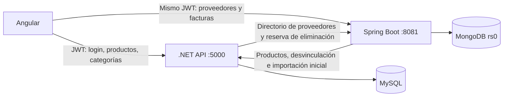

# Suppliers e Invoices: Spring Boot y MongoDB

Suppliers e Invoices se trasladaron al nuevo `purchasing-service`. El frontend consume directamente este servicio; .NET mantiene autenticación, Products y Categories. Las tablas MySQL originales de proveedores y facturas se conservan como archivo de la migración.

## Ejecutar

Desde `practice3/crobless`:

```powershell
docker compose up --build -d
docker compose ps
```

| Servicio | URL/puerto local | Responsabilidad |
|---|---|---|
| Angular/Nginx | http://localhost:81 | Interfaz existente |
| .NET | http://localhost:5000/api | Login, productos y categorías |
| Spring Boot | http://localhost:8081/api | Proveedores y facturas |
| MySQL | localhost:3307 | Datos .NET y archivo SQL anterior |
| MongoDB | Red Docker, sin puerto publicado | Persistencia del microservicio |

Se necesitan libres los puertos 81, 5000, 8081 y 3307. MongoDB ejecuta un replica set de un nodo (`rs0`) para las transacciones. Los volúmenes `db_data` y `mongo_data` persisten los datos. El frontend espera a que Spring termine su importación y esté listo.

La máquina actual tiene Java 11 y no tiene Maven instalado. La compilación Java se realizó dentro de Docker con Java 21 y Maven; no se cambió la instalación Java del equipo.

## Arquitectura



`purchasing-service` usa Spring Boot 3.5.11, Java 21, Spring Security Resource Server, Bean Validation y Spring Data MongoDB con `MongoTemplate`. Las facturas contienen los detalles embebidos; un documento representa una factura completa. Los importes usan `BigDecimal` y BSON `Decimal128`. El impuesto del ejercicio sigue en 0 %, centralizado en `app.tax-rate` y publicado en `/api/invoices/settings`.

Los UUID se conservan como strings con el mismo formato de los GUID anteriores. Se mantienen los contratos JSON consumidos por Angular y la paginación/ordenamiento de Suppliers. Los nombres de proveedor y producto quedan guardados en la factura junto con los precios históricos; editar una factura actualiza esas referencias descriptivas desde sus servicios.

## Autenticación y comunicación interna

.NET sigue emitiendo JWT HS256. Spring valida firma, expiración, issuer `EnterpriseApi` y audience `EnterpriseApp`, y lee el claim de rol que emite .NET. No existe un segundo login.

- Admin, Manager y User: consultas.
- Admin y Manager: creación/edición.
- Admin: eliminación.

Las llamadas entre servicios usan `X-Internal-Key`; un JWT de usuario no da acceso a los endpoints internos. La clave interna no aparece en Angular. Compose configura una clave de desarrollo compartida; `INTERNAL_SERVICE_KEY` y `JWT_KEY` permiten sustituir las claves mediante variables de entorno.

| Variable/configuración | Consumidor | Uso |
|---|---|---|
| `JWT_KEY` | Compose → .NET y Spring | Firma/verificación compartida |
| `INTERNAL_SERVICE_KEY` | Compose → ambos backends | Autenticación interna, mínimo 32 caracteres |
| `MONGODB_URI` | Spring | URI con replica set |
| `CATALOG_URL` | Spring | URL interna de .NET |
| `Purchasing__BaseUrl` | .NET | URL interna de Spring |
| `Purchasing__InternalKey` | .NET | Clave interna fuera de Compose |
| `Purchasing__PublicUrl` | .NET | URL sucesora anunciada en respuestas 410 |
| `environment.purchasingApiUrl` | Angular | URL pública Spring, desarrollo y producción |
| `environment.apiUrl` | Angular | URL pública .NET existente |

## Deprecación .NET

`SuppliersController` e `InvoicesController` responden **410 Gone**, con `Deprecation`, `Link` y `serviceUrl`. No redirigen escrituras ni mantienen dos implementaciones activas. Sus clases y las implementaciones anteriores `SupplierService`/`InvoiceService` tienen `[Obsolete]`; los servicios anteriores se retiraron de DI.

Las entidades, DTOs y migraciones anteriores permanecen disponibles para el archivo e importación. No deben reactivarse los servicios antiguos para atender nuevas escrituras: MongoDB es la fuente actual de esos módulos.

## Migración de datos

1. .NET aplica `20260912011144_DecouplePurchasingReferences`. Retira las FK de Products hacia Suppliers y del detalle histórico hacia Products, conservando columnas, IDs y filas. Las restricciones históricas internas entre Invoice y sus detalles/proveedor permanecen.
2. El nuevo servicio crea sus colecciones e índices.
3. Si no existe el marcador `migrations/mysql-v1`, solicita el archivo SQL mediante `GET /internal/purchasing-export`, autenticado con la clave interna.
4. Importa proveedores y facturas, con IDs, fechas, notas, detalles, precios y totales originales, dentro de una transacción MongoDB. El marcador se guarda en esa misma transacción.
5. Solo después de completar la importación habilita las operaciones y readiness. Un reinicio no vuelve a importar, sobreescribir ni resucitar documentos eliminados.

No se eliminaron tablas, bases, volúmenes ni migraciones anteriores. La exportación está disponible para comparación, pero es un archivo del momento de la migración, no una copia que se actualice con las operaciones MongoDB. Un rollback funcional a MySQL requeriría migrar de regreso las nuevas escrituras; bajar solo la migración EF no es una reversión de datos.

## Integración con Products

`Product.SupplierId` es una referencia externa a MongoDB. `PurchasingClient` valida los proveedores y obtiene sus nombres del directorio interno de Spring. Se conserva la respuesta JSON del producto y el ordenamiento por proveedor. El directorio se consulta en bloque; la combinación y ordenamiento de productos se realizan en memoria para este catálogo del ejercicio.

Para eliminar un producto, .NET pide primero a Spring reservar su ID. Spring comprueba que no esté en ninguna factura y crea una marca que impide agregarlo a nuevas facturas. La comprobación, la reserva y las escrituras de facturas se coordinan mediante transacciones y un documento de control compartido, evitando la carrera entre crear una factura y eliminar su producto.

Si falla la eliminación SQL después de reservar, el ID sigue bloqueado; repetir `DELETE /api/products/{id}` completa la operación. No se libera automáticamente la reserva ante un resultado SQL incierto. Las reservas son internas y no se incluyen en las respuestas de productos.

Al eliminar un proveedor sin facturas, Spring lo marca eliminado y pide a .NET desvincular sus productos. Si .NET falla, la API devuelve 503 y se puede repetir el DELETE. El proveedor eliminado ya no aparece en consultas ni se acepta en nuevas facturas. Las respuestas de productos ocultan las referencias a proveedores que ya no existen. La asignación opcional producto/proveedor y la desvinculación son operaciones entre dos bases, sin una transacción distribuida; una asignación que compita con una eliminación puede dejar temporalmente el ID SQL sin resolver, visible como proveedor nulo y corregible repitiendo la desvinculación.

Ante caída del servicio remoto se devuelve 503; no se vuelve al CRUD MySQL deprecado. Los conflictos transaccionales MongoDB responden 409 para permitir reintentar. La coordinación es deliberadamente sencilla y serializa las escrituras que cambian referencias.

## Endpoints públicos

En `http://localhost:8081`:

| Método | Ruta | Función |
|---|---|---|
| GET | `/api/suppliers` | Listado: search, sortBy, sortDirection, page, pageSize |
| GET | `/api/suppliers/all` | Proveedores activos |
| GET | `/api/suppliers/{id}` | Consultar proveedor |
| POST | `/api/suppliers` | Crear, 201 |
| PUT | `/api/suppliers/{id}` | Editar, 200 |
| DELETE | `/api/suppliers/{id}` | Eliminar/desvincular, 204 |
| GET | `/api/invoices` | Listar facturas |
| GET | `/api/invoices/settings` | Tasa de impuesto |
| GET | `/api/invoices/{id}` | Consultar con detalles |
| POST | `/api/invoices` | Crear, 201 |
| PUT | `/api/invoices/{id}` | Editar, 200 |
| DELETE | `/api/invoices/{id}` | Eliminar factura y detalles, 204 |
| GET | `/actuator/health/readiness` | Disponibilidad del servicio |

Los endpoints `/api/auth`, `/api/products` y `/api/categories` mantienen sus rutas en .NET, puerto 5000. Las rutas Angular no cambian.

## Verificación realizada

- Maven `verify` en Docker: compilación Java y 2 pruebas unitarias correctas.
- `dotnet build`: correcto, 0 errores y 0 advertencias.
- EF `migrations has-pending-model-changes`: sin diferencias pendientes.
- `npm.cmd run build`: correcto; mantiene las dos advertencias CSS de las dependencias existentes.
- `docker compose config --quiet` y `docker compose up --build -d`: correctos; cinco contenedores en ejecución.
- `backend/tests/api_smoke.py`: 61 comprobaciones HTTP correctas contra .NET y Spring; CRUD, validación, permisos, cálculo, historial y restricciones de eliminación.
- `backend/tests/browser_smoke.cjs`: Chrome real en modo headless completó login, proveedor nuevo/editado, producto nuevo y factura nueva/consulta/edición/eliminación. Los requests de Suppliers/Invoices fueron al puerto 8081.
- `backend/tests/microservice_smoke.py`: respuestas 410 y cabeceras, protección interna, JWT con firma/audience/issuer/expiración inválidos, comparación completa del archivo y 5 carreras concurrentes entre crear factura y eliminar producto, sin referencias rotas.
- Comparación inicial: 4 proveedores y 2 facturas incluyendo una pareja temporal creada para la prueba. Tras limpiar únicamente esa prueba, se volvió a verificar la conservación de los 3 proveedores y la factura originales.
- Reinicio de Spring: una modificación Mongo se conservó y una factura eliminada no reapareció desde MySQL.
- Inspección directa MongoDB: total y precio unitario almacenados como `decimal` BSON, no `double`.

Se eliminaron solamente los registros temporales creados por las pruebas. Los datos originales del usuario permanecen en MongoDB y en el archivo SQL.

### Repetir pruebas

Desde `practice3/crobless`, con Compose ejecutándose:

```powershell
python backend/tests/api_smoke.py
node backend/tests/browser_smoke.cjs
python backend/tests/microservice_smoke.py
```

La prueba de Chrome usa Playwright instalado localmente bajo `backend/.tools/browser` y Chrome instalado en el equipo:

```powershell
npm.cmd install --prefix backend/.tools/browser playwright --ignore-scripts --no-audit --no-fund
```

La comparación del archivo en `microservice_smoke.py` es una comprobación de migración: si después se editan/eliminan los registros migrados en MongoDB, ya no se espera que coincidan con el archivo SQL. Los otros scripts crean y limpian sus propios registros.

## Archivos principales

- `purchasing-service/pom.xml`, `Dockerfile`, `src/main/resources/application.yml`.
- `purchasing-service/src/main/java/com/crobless/purchasing/`: aplicación, modelos/DTOs, seguridad, controladores públicos/internos, servicio, cliente de catálogo, importación y errores.
- `purchasing-service/src/test/java/com/crobless/purchasing/InvoiceValidationTest.java`.
- `.NET`: `PurchasingClient.cs`, `PurchasingIntegrationController.cs`, controladores deprecados, `ProductService.cs`, DI, `AppDbContext` y migración `DecouplePurchasingReferences` con su snapshot.
- Angular: servicios `supplier.service.ts`/`invoice.service.ts` y ambos archivos `environment`.
- `docker-compose.yml`, `.gitignore`, documentación y scripts de prueba actualizados.

Referencias utilizadas: [requisitos de Spring Boot 3.5](https://docs.spring.io/spring-boot/3.5/system-requirements.html), [transacciones MongoDB de Spring Data](https://github.com/spring-projects/spring-data-examples/blob/main/mongodb/transactions/README.md) e [índices de Spring Data MongoDB](https://docs.spring.io/spring-data/mongodb/reference/api/java/org/springframework/data/mongodb/core/index/IndexOperations.html).
