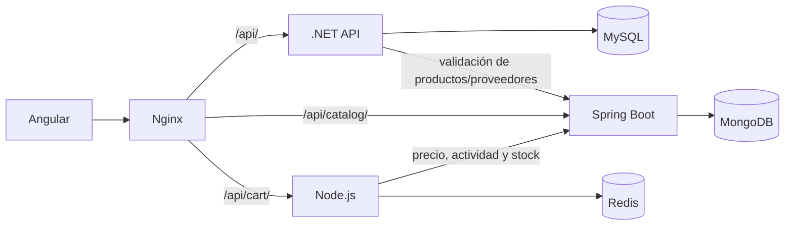

# Carrito Redis y facturación multiproducto — implementación completa

## Alcance y resultado

Fases **1 a 53** implementadas en la rama `eramirez-umg`, dentro de
`practice3/eramirez-umg`. El flujo integra productos → carrito → factura →
persistencia MySQL → vaciado Redis. No se crearon pruebas unitarias, proyectos de
testing ni archivos spec/Jest/xUnit.

## Fase 1: arquitectura encontrada

| Área | Implementación existente |
|---|---|
| Compilación .NET | `backend/src/Api/Api.csproj`, .NET 10, EF Core/Pomelo 9; incluye las carpetas hermanas Application, Domain e Infrastructure. |
| Persistencia | `Infrastructure/Data/AppDbContext.cs`; servicios consultan el contexto directamente, sin repositorios propios. |
| Factura | `Domain/Entities/Invoice.cs`: encabezado y FK a Supplier, sin detalles. |
| Servicio | `Application/Services/InvoiceService.cs`: CRUD, paginación, proveedor activo, número único; subtotal recibido del navegador y total = subtotal + tax. |
| API | `Api/Controllers/InvoicesController.cs`, `/api/invoices`; lectura Admin/Manager/User, escritura Admin/Manager, eliminación Admin. |
| DTO | `Application/DTOs/InvoiceDtos.cs`, creación/actualización con montos manuales. |
| Migraciones | InitialCreate en Infrastructure; AddSuppliersAndInvoices y snapshot en Api/Migrations. El snapshot conservaba Product/Category aunque esas entidades ya no estaban en el modelo. |
| Inicialización | `Program.cs` ejecuta Migrate y DbSeeder al iniciar. `AppDbContextFactory` permite generar migraciones sin MySQL activo. |
| Catálogo | Spring Boot 3.5, Java 21, repositorios Spring Data MongoDB. Productos, categorías y proveedores viven en MongoDB. |
| Producto | `catalog-service/.../model/Product.java`: id string UUID, name, description, price BigDecimal, stock entero, isActive y fechas. |
| Consulta de producto | `GET /api/products/{id}` devuelve id, name, price, stock, isActive, description, categoryName y createdAt. No requiere JWT actualmente. |
| Angular | Angular 18 standalone; `core/models`, `core/services`, `features/invoices`, `features/products`, `features/suppliers`. |
| Servicios Angular | ProductService y SupplierService usan catalogApiUrl; InvoiceService usa apiUrl. |
| Formulario | `features/invoices/pages/invoice-form/invoice-form.component.ts` creaba y editaba encabezados con subtotal/impuesto manuales. |
| Listado | `invoice-list.component.ts`: búsqueda, filtro por estado, paginación, edición y eliminación según rol. |
| Autenticación | AuthService .NET emite JWT HS256 de 8 horas con NameIdentifier, Name, Email y Role; Angular guarda token y usuario y agrega Bearer mediante jwtInterceptor. |
| URLs | environment.ts y environment.prod.ts: backend localhost:5000/api, catálogo localhost:8080/api. |
| Docker | MySQL 8, MongoDB 8, backend, catálogo y frontend, red enterprise_network; puertos 3307, 27017, 5000, 8080 y 81. |
| Nginx | Servía Angular con fallback a index.html; no tenía rutas proxy API. |
| Proveedores | Angular administra proveedores MongoDB, pero Invoice mantiene una FK MySQL: era necesario resolver ambas representaciones. |


## Arquitectura implementada



Se reutilizan servicios, modelos, estilos y permisos existentes. .NET sigue siendo
un solo proyecto compilado con carpetas por capa; no se añadieron repositorios
artificiales ni otro sistema de login. El catálogo conserva su implementación.

## Cobertura de fases 21–53

| Fases | Implementación |
|---|---|
| 21 | CartService centraliza HTTP, URL /me, señales de estado, contador, carga y errores. |
| 22 | Pantalla Cart con productos, precio, cantidad, subtotal, controles +/−, eliminación y totales estimados. |
| 23–24 | Add to cart en productos y contador de unidades en la navegación; sin recarga completa. |
| 25–28 | Formulario usa Redis, refresca antes de enviar y vacía solo después de la respuesta exitosa de .NET. |
| 29 | Invoice, detalles y nueva referencia SQL del proveedor se guardan mediante un único SaveChangesAsync transaccional. |
| 30–32 | GET/listado con detalles, pantalla de consulta para todos los roles de lectura, edición de encabezado preservando snapshots. |
| 33 | Estados de carga/error/éxito, confirmaciones, foco visible, labels y diseño adaptable. |
| 34–36 | Dockerfile Node 22, Redis y carrito en Compose, healthchecks y plantillas de variables sin secretos. |
| 37–38 | Nginx y proxy de desarrollo, rutas API relativas centralizadas en environment. |
| 39–40 | JWT existente, verificación de firma/issuer/audience/expiración y aislamiento por usuario. |
| 41–42 | Errores JSON coherentes y healthcheck que comprueba Redis. |
| 43–45 | Catálogo revalidado al facturar, precio confiable, actividad, existencia y disponibilidad de stock. |
| 46–48 | README actualizado y esta documentación técnica con sección UX/UI. |
| 49–50 | Compilaciones, Docker, solicitudes HTTP y flujo real de navegador; sin unit tests. |
| 51–52 | Login, productos, proveedores, consulta/edición de facturas y facturas históricas conservados. |
| 53 | Sin servicios duplicados, selector temporal de productos eliminado del formulario, URLs centralizadas y dependencias/secretos ignorados por Git. |

## Invoice / InvoiceDetail y migración

Invoice tiene una colección 1:N de InvoiceDetail. Cada línea contiene Id, InvoiceId,
ProductId, ProductName, Quantity, UnitPrice y Subtotal.

- PK y FK son UUID; la FK hacia Invoice usa cascada.
- ProductId es string de hasta 128 caracteres porque vive en otro servicio.
- ProductName conserva hasta 500 caracteres como snapshot.
- UnitPrice/Subtotal son decimal(18,2).
- Índice único (InvoiceId, ProductId).
- Restricciones Quantity > 0, UnitPrice >= 0, Subtotal >= 0.
- Se conserva decimal(65,30) de los montos existentes del encabezado para no truncar datos.

La migración `20260915171737_AddInvoiceDetails` crea únicamente la tabla de detalles
y su índice. Se retiraron los DROP de Products/Categories propuestos por EF debido
al snapshot antiguo: esas tablas, cuando existen, permanecen intactas.
El modelo snapshot se actualizó a las entidades actuales. En una base nueva,
InitialCreate crea Products, pero no Categories. No se añadió otra migración en
las fases 21–53 porque los cambios restantes no alteran el esquema SQL.

Al editar facturas con detalles, el servidor recalcula usando las líneas históricas
y conserva nombres/precios. Las facturas previas sin líneas devuelven `details: []`
y mantienen la edición de montos. La lectura no depende de que los productos sigan
existiendo en el catálogo.

## Creación y validaciones

```json
{
  "supplierId": "UUID",
  "number": "FAC-001",
  "issueDate": "2026-09-15",
  "dueDate": null,
  "tax": 12,
  "status": "Pending",
  "notes": "Compra",
  "items": [
    { "productId": "UUID-A", "quantity": 2 },
    { "productId": "UUID-B", "quantity": 3 }
  ]
}
```

El backend agrupa productos repetidos, consulta su estado actual en el catálogo y
valida existencia, actividad, nombre, precio, stock y cantidad entera positiva.
Valida proveedor activo, número no vacío de hasta 255 caracteres, unicidad, fechas
y estados Pending/Paid/Cancelled. No confía en precios/subtotales/totales enviados
por el navegador.

El precio se redondea a dos decimales con mitades hacia arriba. El subtotal de cada
línea es cantidad × precio; el subtotal de factura es la suma de líneas.
Tax sigue siendo un **monto**, validado y redondeado, sin introducir una tasa fiscal.
Total = subtotal + tax. Node usa decimal.js para calcular importes del carrito.

El stock se comprueba tanto al modificar el carrito como al facturar. No se reserva
ni descuenta stock; no se introdujo un sistema de inventario distribuido.

El proveedor del catálogo que aún no está en MySQL se incorpora con el mismo UUID,
junto con la factura. Si su TaxId pertenece a otro UUID SQL se rechaza con 409.
Las referencias SQL existentes no se reasignan ni se sincronizan continuamente.
Se admiten proveedores SQL anteriores cuando el catálogo no tiene ese UUID.

## Transacción y cierre de compra

1. Angular refresca el carrito.
2. Si no contiene productos o expiró, no envía la factura.
3. Si cambió respecto al mostrado, actualiza las líneas y pide revisarlas.
4. Envía encabezado e identificadores/cantidades al backend.
5. .NET vuelve a validar el catálogo y calcula los montos.
6. Guarda Invoice + InvoiceDetails y, si corresponde, Supplier SQL en una llamada
   SaveChangesAsync. MySQL aplica la transacción.
7. Después de recibir éxito, Angular conserva el resultado y solicita el vaciado
   con `If-Match: version`.
8. Si se vacía, abre el detalle con montos definitivos y contador cero.

La comparación y eliminación del carrito son atómicas en Redis:

- Si el carrito no existe porque expiró o ya fue vaciado, el DELETE es idempotente.
- Si otro request cambió su versión, responde 409 y conserva el carrito actual.
- Si falla Redis después del guardado, la pantalla conserva la factura guardada,
  deshabilita otra creación y ofrece **Retry emptying cart**. Ese botón solo llama DELETE.
- Si falla .NET, no se llama DELETE y permanecen formulario y carrito.
- Si la respuesta de creación se pierde por una interrupción de red, el cliente no
  puede asegurar si hubo commit: indica revisar el listado antes de reintentar.
  No se implementó una transacción distribuida ni un protocolo de creación exactamente una vez.

La protección del reintento de vaciado pertenece a la pantalla abierta. Si se abandona
esa pantalla, la factura sigue disponible en el listado y el carrito puede revisarse
y vaciarse explícitamente.

## API del carrito

Todas las rutas /api/cart requieren el JWT existente. `cartId` puede ser `me` o
el UUID propio; la clave se deriva siempre del usuario verificado.

| Método | Endpoint | Respuesta |
|---|---|---|
| GET | /api/cart/:cartId | 200, carrito o estructura vacía. |
| POST | /api/cart/:cartId/items | 201, agrega o acumula {productId, quantity}. |
| PUT | /api/cart/:cartId/items/:productId | 200, establece {quantity}. |
| DELETE | /api/cart/:cartId/items/:productId | 200, elimina solo esa línea y recalcula. |
| DELETE | /api/cart/:cartId | 204; If-Match opcional compara la versión antes de vaciar. |
| GET | /health | 200 {status: "UP"} si Redis responde; 503 si no. |

Sin token/token inválido: 401; otro usuario/rol de escritura no permitido: 403;
body/cantidad inválidos: 400; producto/línea ausentes: 404; inactividad, stock o
conflicto de versión: 409; servicio no disponible: 503.
Los errores exponen `message`, nunca stack traces. Express maneja JSON inválido y
limita el tamaño del body. Un vaciado explícito sin If-Match sigue siendo compatible
con clientes anteriores; Angular siempre envía la versión mostrada.

## Modelo Redis, TTL y concurrencia

Clave `cart:{UUID autenticado}`, valor JSON:

```json
{
  "cartId": "UUID",
  "version": "UUID de la modificación",
  "items": [
    { "productId": "UUID-A", "name": "Mouse", "quantity": 2, "unitPrice": 25.5, "subtotal": 51 }
  ],
  "subtotal": 51,
  "totalQuantity": 2,
  "updatedAt": "2026-09-15T18:00:00.000Z"
}
```

TTL predeterminado 86400 segundos, renovado con cada modificación exitosa.
Leer no renueva el TTL ni crea claves. Alta/actualización consulta precio, actividad
y stock actuales; eliminar una línea no necesita que el producto siga en el catálogo.
Redis usa AOF y volumen propio.

Las modificaciones comparan el JSON leído con el actual y aplican SET con EX dentro
de Lua, reintentando hasta 10 veces ante concurrencia. Cada modificación genera una
versión UUID. El DELETE condicional compara esa versión y elimina dentro de otro
script atómico. Los carritos anteriores sin version usan updatedAt como compatibilidad.

## Autenticación y estado Angular

Se reutiliza JWT HS256 de .NET, con NameIdentifier, Role, issuer, audience y expiración.
El microservicio verifica la firma y nunca acepta una identidad arbitraria del navegador.
Admin/Manager pueden modificar; User conserva lectura de facturas.

CartService mantiene señales de carrito, contador, carga, operación y error.
El contador suma quantity, no las líneas distintas. Refresca al abrir carrito/formulario,
al iniciar sesión y cada minuto mientras la sesión existe. Reinicia el estado al
cambiar de usuario; ignora respuestas de peticiones de la sesión anterior.
No persiste un carrito duplicado en localStorage.

El interceptor agrega Bearer solo a las rutas API configuradas. El catálogo mantiene
sus contratos y protección preexistentes; no se implantó un segundo login.

## UX/UI

- Se reutilizan estilos y organización features/core, sin otra librería UI.
- Products incorpora Add to cart con estado Adding, confirmación y error.
  Productos inactivos o sin stock muestran Unavailable.
- Navegación con contador, estados de carga/indisponibilidad y ajuste a móvil.
- Cart muestra nombre, precio, cantidad, subtotal y acciones; permite +, − o
  cantidad entera directa. Se confirman eliminación individual y vaciado completo.
- Bloqueo temporal de acciones durante modificaciones para impedir dobles envíos.
- El formulario usa un componente compartido de líneas del carrito, conserva el
  encabezado y no solicita subtotal manual en facturas nuevas.
- Se muestran estimados y se explica la revalidación de precios/stock.
- Detalle de factura accesible a roles de lectura, con líneas históricas y montos finales.
- Labels, nombres accesibles, encabezados de tabla, foco visible, roles status/alert,
  contraste y tablas con desplazamiento horizontal dentro de su contenedor.
- La página completa no desborda horizontalmente en el viewport móvil de 390 px.
- Errores de carga recuperables, datos conservados ante fallos y mensaje específico
  si se guardó la factura pero falta vaciar el carrito.

## Docker, Nginx y configuración

Dockerfile de carrito: Node 22 Alpine, npm ci --omit=dev, usuario node,
.dockerignore y arranque independiente. Los siete servicios comparten
enterprise_network; Redis no publica puertos al host.

Nginx dirige /api/cart/ al carrito, /api/catalog/ al catálogo (reescrito a /api/)
y /api/ al backend. Se conservan rutas SPA. Angular usa URLs relativas en ambos
environments; proxy.conf.json proporciona equivalentes para ng serve.
Cambiar el puerto público del frontend no requiere recompilar las URLs API.

Se retiraron container_name globales: Compose asigna nombres por proyecto.
Los puertos de host se configuran mediante variables; esto permite coexistir con
otras prácticas. Los nombres lógicos de servicios, red y volúmenes no cambiaron.

| Variable | Uso |
|---|---|
| JWT_KEY | Obligatoria, compartida con .NET, al menos 32 bytes. |
| JWT_ISSUER / JWT_AUDIENCE | EnterpriseApi / EnterpriseApp por defecto en Compose. |
| PORT | 3000 para cart-service. |
| REDIS_HOST / REDIS_PORT | redis / 6379 en Compose. |
| CART_TTL_SECONDS | 86400 por defecto. |
| CATALOG_SERVICE_URL | http://catalog-service:8080 en Docker. |
| FRONTEND_ORIGIN | Orígenes permitidos en ejecución directa. El frontend Docker usa Nginx. |
| CatalogService__Url | URL de catálogo para .NET. |
| FRONTEND_PORT / BACKEND_PORT / CATALOG_PORT / CART_PORT | 81 / 5000 / 8080 / 3000. |
| MYSQL_PORT / MONGO_PORT | 3307 / 27017. |

Las plantillas .env.example no contienen secretos. La configuración local .env,
dependencias, salidas de compilación y herramientas temporales están ignoradas.

## Archivos creados y modificados

### Creados en fases 1–20

InvoiceDetail.cs, CatalogClient.cs, migración/diseñador AddInvoiceDetails,
cart-service (src, Dockerfile, package/lock, .dockerignore, .env.example),
cart.model.ts, cart.service.ts, invoice-form.component.html,
.env.example, backend/.dockerignore y este documento.

### Creados en fases 21–53

- frontend/src/app/core/models/api-error.ts.
- frontend/src/app/features/cart/components/cart-items.component.ts.
- frontend/src/app/features/cart/pages/cart.component.ts.
- frontend/src/app/features/invoices/pages/invoice-detail/invoice-detail.component.ts.
- frontend/proxy.conf.json.

### Modificados

- Backend de la primera entrega: Invoice.cs, AppDbContext.cs, snapshot,
  InvoiceDtos.cs, InvoiceService.cs y Program.cs.
- Carrito: modelos, servicio, rutas y CORS para versionado/vaciado condicional.
- Angular: CartService, modelo Cart, app.component/routes, interceptor,
  product-list, invoice-form, invoice-list, environments, angular.json y estilos.
- Docker Compose, nginx.conf, .env.example, .gitignore y README.

## Ejecución y validación manual

Ver [README.md](README.md) para preparación de .env, puertos y arranque.

```powershell
docker compose config --quiet
docker compose up -d --build
docker compose ps
```

Compilación local: dotnet restore/build en backend, npm ci/run build en frontend
y cart-service. Para catálogo, si se modifica, Maven con -DskipTests.
No se crean ni ejecutan pruebas unitarias en esta implementación.

Procedimiento manual mínimo:

1. Iniciar sesión como Admin y tener proveedor y dos productos activos con stock.
2. Agregar A x1, B x3 y otra unidad de A; comprobar consolidación y contador.
3. Modificar cantidades con +/− y entrada directa, eliminar una línea y revisar totales.
4. Crear una factura con dos productos y consultar su detalle y las tablas MySQL.
5. Confirmar que la clave Redis desaparece tras el éxito.
6. Intentar facturar producto eliminado/inactivo o cantidad mayor al stock;
   verificar error y conservación del carrito.
7. Comprobar factura histórica sin detalles y edición del encabezado.
8. Probar expiración de Redis, usuario diferente y un fallo al vaciar tras guardar.

## Referencias técnicas

- [Transacciones de SaveChanges en EF Core](https://learn.microsoft.com/en-us/ef/core/saving/transactions).
- [Señales y limpieza de efectos en Angular 18](https://v18.angular.dev/guide/signals/).
- [Atomicidad de scripts Redis](https://redis.io/docs/latest/develop/interact/programmability/eval-intro/).

## Resultados de validación

Validación del 15 de septiembre de 2026:

- .NET: compilación correcta, cero advertencias y errores. No fue necesaria una nueva migración.
- Angular: build de producción correcto; la construcción Docker final incluye el ajuste de recuperación de carga.
- Node: comprobación de sintaxis de todos los módulos y build correctos.
- Docker Compose: configuración válida y construcción/arranque de los siete servicios.
  MySQL, MongoDB, catálogo, Redis y carrito saludables; backend y Nginx activos.
- Proyecto aislado `eramirez-phase53-check`, con volúmenes propios y puertos
  15000/18080/13000/18081; no se sustituyeron contenedores de otras prácticas.
- **24 comprobaciones de navegador** con Chrome, contra los servicios reales:
  login, alta desde productos, contador de unidades, carrito persistido, +/−,
  cantidad directa, eliminación confirmada, montos y traslado del impuesto,
  factura multiproducto, consulta, vaciado tras éxito y acceso de User a detalles.
- Se simuló un 503 de facturación en el navegador y se comprobó que Redis y el
  formulario conservaron sus datos. También se provocó un rechazo real del backend
  por desactivar un producto después de añadirlo; el carrito permaneció intacto.
- Se simuló una respuesta 503 del vaciado posterior al guardado: se conservó la
  factura y el reintento realizó DELETE sin otro POST de factura.
- Se agregó un producto concurrentemente después del guardado y antes del vaciado:
  el DELETE respondió 409 y se conservaron las líneas actuales del carrito.
- Se comprobó recuperación de un fallo inicial al cargar proveedores mediante Retry loading.
- Caso principal: A x2 a 25.50 + B x3 a 10.00 = subtotal 81.00, impuesto 12.00,
  total 93.00. MySQL confirmó la factura con dos InvoiceDetails; Redis quedó sin clave.
- Cambiar el precio del catálogo a 50.00 antes del checkout produjo una factura
  nueva a 50.00; editar la factura anterior conservó su precio original de 25.50.
- Una factura histórica insertada sin detalles se mostró y editó correctamente:
  `details: []`, subtotal actualizado a 200, impuesto 20, total 220.
- Escritorio 1440 px y móvil 390 px revisados mediante capturas; sin desbordamiento
  horizontal de la página. La tabla conserva desplazamiento dentro del contenedor.
- Sin errores de JavaScript en los recorridos de navegador. Proxy de autenticación,
  catálogo, carrito y facturas funcionando con rutas relativas del mismo origen.
- `git diff --check` correcto; no se incorporan archivos unitarios, node_modules,
  secretos .env ni herramientas temporales a los cambios de Git.

Las imágenes de validación incorporaron temporalmente certificados públicos ya
confiables de Windows para descargar dependencias en esta red. No se desactivó TLS
ni se añadieron certificados de esta máquina a los Dockerfiles del proyecto.
Una construcción estándar en una red con inspección TLS requiere configurar esa
confianza. El entorno de validación y sus herramientas temporales se retiraron al finalizar.

## Configuración local posterior para construcciones Docker

Ante el error PKIX de Maven al ejecutar una construcción estándar, se añadió
`scripts/Enable-DockerBuildTrust.ps1`. Exporta certificados raíz públicos vigentes
de los almacenes de confianza de Windows y genera un override local de Compose
para Java, .NET y Node. Este override se carga al ejecutar `docker compose up -d --build`.

Los certificados y `docker-compose.override.yml` están ignorados por Git. No se
modifican las claves de la aplicación ni se desactiva la verificación TLS. La
configuración no altera los servicios, puertos o volúmenes del archivo principal.
El override contiene los Dockerfiles actuales con la configuración de certificados;
se debe regenerar con el script si cambian los Dockerfiles o la confianza de Windows.
Ver los comandos en [README.md](README.md#resolver-pkix--certificados-en-windows).
