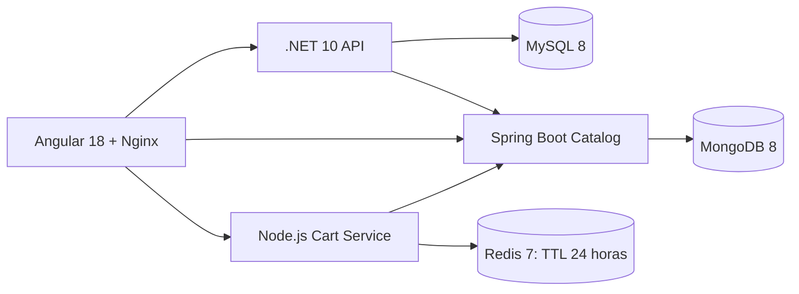

# Enterprise Management Solution

Aplicación de administración con facturación multiproducto y carrito temporal por usuario.
Implementación de las fases 1–53 del documento de requisitos en `practice3/eramirez-umg`.

## Arquitectura



- **.NET / EF Core 9 / Pomelo:** autenticación, proveedores SQL e Invoice + InvoiceDetails.
- **Spring Boot 3.5 / Java 21:** productos, categorías y proveedores en MongoDB.
- **Node.js / Express:** carrito Redis, precios consultados al catálogo y acceso mediante el JWT existente.
- **Angular:** productos, proveedores, carrito, creación/edición y consulta de facturas.

## Iniciar con Docker

Desde este directorio:

1. Copiar `.env.example` a `.env` si todavía no existe.
2. Configurar `JWT_KEY` con al menos 32 bytes. Para una instalación existente, reutilizar
   el `Jwt:Key` del backend para conservar sus tokens.
3. Ejecutar:

```powershell
docker compose config --quiet
docker compose up -d --build
docker compose ps
```

Abrir **http://localhost:81**. MySQL aplica automáticamente las migraciones al iniciar .NET.
Los volúmenes de MySQL, MongoDB y Redis conservan los datos entre reinicios.

Si otra práctica ocupa un puerto, modificar los valores de `.env`. Los contenedores
usan nombres asignados por Compose, sin nombres globales compartidos. Para una
instalación adicional se puede usar `docker compose -p otro-nombre ...`; esto crea
otro conjunto de volúmenes, no reutiliza automáticamente los de la instalación original.

| Servicio | Puerto predeterminado del host | Variable |
|---|---|---|
| Angular/Nginx | 81 | FRONTEND_PORT |
| .NET | 5000 | BACKEND_PORT |
| Catálogo | 8080 | CATALOG_PORT |
| Carrito | 3000 | CART_PORT |
| MySQL | 3307 | MYSQL_PORT |
| MongoDB | 27017 | MONGO_PORT |
| Redis | Sin publicación al host; 6379 interno | — |

## Flujo de compra

1. Iniciar sesión como Admin o Manager.
2. En Products, pulsar **Add to cart** en uno o varios productos.
3. Abrir **Cart** en la navegación. El contador suma unidades.
4. Modificar cantidades, eliminar líneas o vaciar el carrito con confirmación.
5. Indicar el impuesto como **monto**, luego pulsar **Create invoice**.
6. Completar proveedor, número, fechas, estado y notas.
7. El backend consulta los productos actuales, valida precio/actividad/stock,
   consolida repetidos y guarda encabezado y líneas en una transacción.
8. Solo después del éxito se vacía la versión comprada del carrito y se abre el detalle.

Si falla la factura, el carrito se conserva. Si la factura se guarda pero falla el
vaciado, la pantalla permite **Retry emptying cart** sin reenviar la factura.
Si otra pestaña cambió el carrito durante el guardado, sus elementos se conservan
y se muestra un aviso para revisarlos.

Los precios de facturas guardadas son snapshots históricos. La edición conserva
esas líneas y permite cambiar el encabezado. Las facturas antiguas sin líneas
siguen mostrándose y permiten editar sus montos.

## Autenticación y permisos

Se mantiene el login `/api/auth/login`, con JWT HS256, issuer y audience compartidos.
Las cuentas iniciales de desarrollo se definen en `backend/src/Infrastructure/Data/DbSeeder.cs`.

| Rol | Permisos de facturación/carrito |
|---|---|
| Admin | Crear/editar/consultar/eliminar facturas y modificar su carrito. |
| Manager | Crear/editar/consultar facturas y modificar su carrito. |
| User | Consultar facturas; sin operaciones de escritura del carrito. |

El carrito se identifica por el usuario verificado, no por un ID libre proporcionado
por Angular. El catálogo conserva su autenticación y contratos existentes.

## API y proxy

El navegador usa rutas del mismo origen, centralizadas en los archivos environment:

| Ruta del navegador | Servicio interno |
|---|---|
| `/api/cart/*` | cart-service:3000 |
| `/api/catalog/*` | catalog-service:8080/api/* |
| Resto de `/api/*` | backend:80 |

| Método | Endpoint del carrito | Body |
|---|---|---|
| GET | `/api/cart/me` | — |
| POST | `/api/cart/me/items` | `{ productId, quantity }` |
| PUT | `/api/cart/me/items/:productId` | `{ quantity }` |
| DELETE | `/api/cart/me/items/:productId` | — |
| DELETE | `/api/cart/me` | —; If-Match opcional con la versión |
| GET | `http://localhost:3000/health` | — |

Las rutas del carrito requieren Bearer salvo health. Redis renueva el TTL de 86400
segundos al modificar; las lecturas no prolongan su vida. Utiliza AOF y volumen propio.

## Desarrollo local

Requisitos: .NET SDK indicado por `backend/global.json`, Node.js 22+, Java 21,
Maven, MySQL, MongoDB y Redis.

- Backend: configurar `ConnectionStrings__DefaultConnection` y `CatalogService__Url`;
  ejecutar `dotnet restore` y `dotnet run --project src/Api` desde backend, con URL en el puerto 5000.
- Catálogo: ejecutar `mvn spring-boot:run` desde catalog-service, con MongoDB disponible.
- Carrito: copiar `cart-service/.env.example` a `cart-service/.env`, configurar el mismo JWT,
  Redis y catálogo; ejecutar `npm ci` y `npm run dev`.
- Frontend: `npm ci` y `npm start`. `proxy.conf.json` dirige las rutas API hacia
  los puertos locales 5000, 8080 y 3000. Ajustar ese archivo si se cambian esos puertos.

No se crean pruebas unitarias para este alcance. Las compilaciones, solicitudes HTTP
y comprobaciones de navegador se detallan en la documentación técnica.

## Documentación

[CART-INVOICE-IMPLEMENTATION.md](CART-INVOICE-IMPLEMENTATION.md) incluye análisis,
archivos, migración, seguridad, modelo Redis, consistencia, UX/UI y validaciones.

El stock se valida pero no se reserva ni descuenta: el catálogo actual no ofrece una
operación transaccional de reserva. El impuesto conserva la regla original como monto.

En redes con inspección TLS, las herramientas y contenedores de construcción deben
confiar en el certificado de esa red. La validación de este entorno utilizó los
certificados confiables de Windows en imágenes temporales, sin desactivar TLS.

### Resolver PKIX / certificados en Windows

Si Maven muestra `PKIX path building failed` o npm no puede verificar certificados,
ejecutar desde este directorio (Docker Compose 2.24.4 o posterior):

```powershell
powershell -NoProfile -ExecutionPolicy Bypass -File .\scripts\Enable-DockerBuildTrust.ps1
docker compose up -d --build
```

El script exporta únicamente certificados raíz públicos y vigentes ya confiables
de Windows. Genera `.docker-local/trust/` y `docker-compose.override.yml`, ambos
ignorados por Git. Compose carga automáticamente ese override e incorpora la
confianza en Java, .NET y Node durante la construcción. No desactiva TLS ni cambia
volúmenes, puertos o servicios. La opción ExecutionPolicy solo afecta ese proceso.

Repetir el script si cambian los Dockerfiles o los certificados raíz de Windows.
Para dejar de usar esta configuración, retirar el archivo generado
`docker-compose.override.yml`; la siguiente construcción usará los Dockerfiles originales.
Referencia: [certificados CA dentro de contenedores](https://docs.docker.com/engine/network/ca-certs/).
