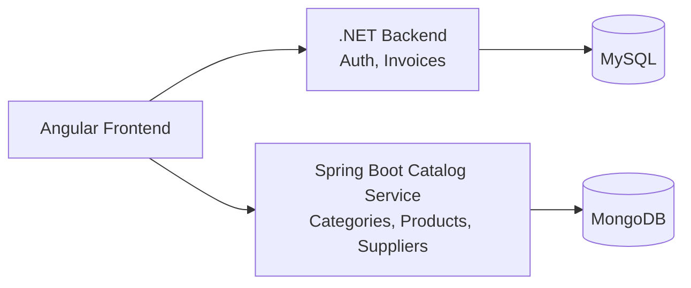

# Enterprise Management Solution

Full-stack enterprise application built with **.NET 10 Web API**, **Angular 18**, **Spring Boot**, **MongoDB**, and **MySQL 8**.

The backend follows a layered (Clean Architecture) structure — Api, Application, Domain, Infrastructure — compiled as a single project. It uses JWT authentication with role-based authorization (Admin, Manager, User), Entity Framework Core with the Pomelo MySQL provider, and BCrypt password hashing.

## Tech Stack

| Layer     | Technology                                             |
|-----------|--------------------------------------------------------|
| Frontend  | Angular 18 (standalone components), served via Nginx   |
| Backend   | ASP.NET Core 10 Web API, EF Core 9 (Pomelo MySQL)      |
| Catalog   | Spring Boot 3.5, Spring Data MongoDB                   |
| Databases | MySQL 8.0 for .NET; MongoDB 8.0 for catalog            |
| Auth      | JWT Bearer tokens, BCrypt password hashing             |

## Ports

When running via Docker Compose, the host-side ports are:

| Service   | Host URL / Port           | Container Port | Notes                                    |
|-----------|---------------------------|----------------|------------------------------------------|
| Frontend  | `http://localhost:81`     | 80             | Angular app served by Nginx              |
| Catalog   | `http://localhost:8080`   | 8080           | Catalog REST API + healthcheck           |
| Backend   | `http://localhost:5000`   | 80             | REST API + Swagger                       |
| MongoDB   | `localhost:27017`         | 27017          | `catalog_db`, persistent volume          |
| MySQL     | `localhost:3307`          | 3306           | `root` / `YourSecurePassword123!`        |

Useful backend URLs:

- **API base**: `http://localhost:5000/api`
- **Catalog API base**: `http://localhost:8080/api`
- **Catalog health**: `http://localhost:8080/actuator/health`
- **Swagger** (Development only): `http://localhost:5000/swagger`

> Note: inside Docker, .NET reaches MySQL at `Server=db` and Spring reaches MongoDB at `mongodb://mongo:27017/catalog_db`. The browser uses the published ports.

## Arquitectura de microservicios



## Ownership de dominios

| Dominio | Backend responsable | Persistencia |
|---|---|---|
| Authentication | .NET | MySQL |
| Invoices | .NET | MySQL |
| Categories | Spring Boot | MongoDB |
| Products | Spring Boot | MongoDB |
| Suppliers | Spring Boot para el catálogo | MongoDB |

Supplier conserva temporalmente una representación SQL y su endpoint .NET porque Invoices todavía mantiene `SupplierId`, `SupplierName` y una FK SQL. Las nuevas operaciones del catálogo Angular usan Spring.

## Quick Start (Docker)

Run the whole stack (MySQL + MongoDB + .NET + Spring Boot + Angular):

```bash
docker compose up -d --build
```

On startup:

1. MySQL and MongoDB start with healthchecks and persistent volumes.
2. The .NET backend applies EF Core migrations and seeds Auth roles/users.
3. Spring Boot exposes `/actuator/health` and seeds catalog data only when collections are empty.

Then open <http://localhost:81> and log in.

To stop and remove the containers:

```bash
docker compose down
```

To also wipe the database volume (fresh start):

```bash
docker compose down -v
```

Use `down -v` only for a fresh reset. Without `-v`, MongoDB and MySQL data persist.

## Seeded Accounts

The database is seeded on first startup with these accounts (idempotent — safe on every run):

| Role  | Email                   | Password    |
|-------|-------------------------|-------------|
| Admin | admin@enterprise.com    | `Admin123!` |
| User  | user@enterprise.com     | `User123!`  |

Roles seeded: **Admin** (full access), **Manager** (manage products), **User** (read-only).

> These are development defaults. Change them before using anywhere beyond local development.

### Role permissions (catalog)

| Action              | Admin | Manager | User |
|---------------------|:-----:|:-------:|:----:|
| View / list         |  ✅   |   ✅    |  ✅  |
| Create / update     |  ✅   |   ✅    |  ❌  |
| Delete              |  ✅   |   ❌    |  ❌  |

## Manual Development Setup

Requires the **.NET 10 SDK** (pinned via `backend/global.json`), **Java 21**, **Maven 3.9+**, **Node.js 20+**, **MySQL 8**, and **MongoDB 8**.

### 1. Start a MySQL instance

```bash
docker run --name enterprise_db \
  -e MYSQL_ROOT_PASSWORD=YourSecurePassword123! \
  -e MYSQL_DATABASE=EnterpriseDb \
  -p 3307:3306 -d mysql:8.0
```

### 2. Backend

The default connection string in `appsettings.json` points to `Server=localhost` on port `3306`. If you use the container above (host port `3307`), override the connection string:

```bash
cd backend
export ConnectionStrings__DefaultConnection="Server=localhost;Port=3307;Database=EnterpriseDb;User Id=root;Password=YourSecurePassword123!;"
dotnet run --project src/Api/Api.csproj
```

The API starts, applies migrations, and seeds the default accounts. It listens on `http://localhost:5000` by default when run this way (adjust `ASPNETCORE_URLS` if needed).

### 3. Catalog service

```bash
cd catalog-service
set SPRING_DATA_MONGODB_URI=mongodb://localhost:27017/catalog_db
mvn spring-boot:run
```

The catalog service listens on `http://localhost:8080`.

### 4. Frontend

```bash
cd frontend
npm install
npm start
```

The dev server runs on `http://localhost:4200` and uses `apiUrl` for .NET (`http://localhost:5000/api`) plus `catalogApiUrl` for Spring (`http://localhost:8080/api`). Production builds use `environment.prod.ts` via the `fileReplacements` configured in `angular.json`.

## Database Migrations

Migrations live in `backend/src/Infrastructure/Data/Migrations`. A design-time factory (`AppDbContextFactory`) lets EF tooling build the context without a live database.

Create a new migration:

```bash
cd backend
dotnet ef migrations add <Name> --project src/Api/Api.csproj --output-dir ../Infrastructure/Data/Migrations
```

Apply migrations manually (usually not needed — the app does this on startup):

```bash
dotnet ef database update --project src/Api/Api.csproj
```

## API Ownership

The .NET API owns `/api/auth` and `/api/invoices`. Spring Boot owns `/api/categories`, `/api/products`, and `/api/suppliers`. Angular selects the backend through `apiUrl` and `catalogApiUrl` in its environment files.

`GET /api/products` supports `search`, `sortBy` (`name`, `price`, `stock`, `category`, `createdat`), `sortDirection` (`asc`/`desc`), `page`, and `pageSize`.

## Project Structure

```text
.
├── docker-compose.yml
├── catalog-service/
│   ├── Dockerfile
│   ├── pom.xml
│   └── src/                    # models, DTOs, repositories, services, REST
├── backend/
│   ├── Dockerfile
│   ├── global.json                 # pins .NET SDK 10
│   └── src/
│       ├── Api/                    # controllers, Program.cs, appsettings
│       ├── Application/            # Auth, Invoices and Supplier compatibility
│       ├── Domain/                 # entities (User, Role, Supplier, Invoice)
│       └── Infrastructure/         # AppDbContext, migrations, seeder
└── frontend/
    ├── Dockerfile
    └── src/
        ├── app/                    # components, services, guards, interceptors
        └── environments/           # apiUrl and catalogApiUrl
```
